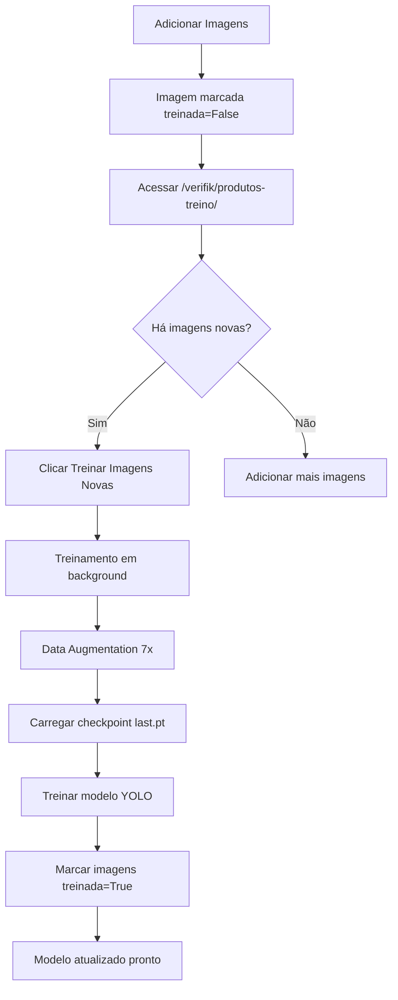

# 🚀 Sistema de Treinamento Incremental - VerifiK

## ✨ Funcionalidades Implementadas

### 1. **Treinamento de Imagens Não Treinadas**
- ✅ Campo `treinada` adicionado ao modelo `ImagemProduto`
- ✅ Campo `data_treinamento` para rastrear quando foi treinada
- ✅ Botão na interface para treinar apenas imagens novas
- ✅ Continuação automática do último checkpoint

### 2. **Interface Web de Treinamento**
- 📊 Visualização de estatísticas (imagens novas vs treinadas)
- 🎯 Lista de produtos com contadores por produto
- 🔴 Destaque para produtos com imagens novas
- ✅ Botão "Treinar Imagens Novas" (desabilitado se não houver)

### 3. **Comando de Treinamento Aprimorado**
- 🔄 Modo `--only-new` para treinar apenas imagens não treinadas
- 📍 Continua do checkpoint `last.pt` automaticamente
- 🎨 Data Augmentation com Albumentations (7 variações/imagem)
- ⚡ Execução em background via threading

---

## 📋 Como Usar

### **Passo 1: Aplicar Migration**
```bash
cd C:\Users\mlisb\OneDrive\Desktop\ProjetoLogus
python manage.py makemigrations
python manage.py migrate
```

### **Passo 2: Acessar Interface Web**
Acesse no navegador:
```
http://localhost:8000/verifik/produtos-treino/
```

### **Passo 3: Adicionar Imagens de Produtos**
1. Vá até o admin Django ou use a interface VerifiK
2. Adicione novas imagens para produtos
3. As imagens serão marcadas automaticamente como `treinada=False`

### **Passo 4: Treinar Apenas Imagens Novas**

**Opção A: Via Interface Web (Recomendado)**
1. Acesse `http://localhost:8000/verifik/produtos-treino/`
2. Verifique o contador "Imagens Novas" no topo
3. Clique no botão **"🚀 Treinar Imagens Novas"**
4. Confirme a ação
5. O treinamento será iniciado em background

**Opção B: Via Linha de Comando**
```bash
python manage.py treinar_incremental --only-new
```

### **Passo 5: Monitorar Progresso**
O treinamento roda em background. Você pode:
- Continuar usando o sistema normalmente
- Verificar logs no terminal onde o servidor está rodando
- Aguardar conclusão (vários minutos dependendo das imagens)

---

## 🔧 Parâmetros do Comando

```bash
python manage.py treinar_incremental [opções]
```

### Opções disponíveis:

| Parâmetro | Padrão | Descrição |
|-----------|--------|-----------|
| `--only-new` | False | Treina apenas imagens com `treinada=False` |
| `--augmentations` | 7 | Número de variações por imagem (augmentation) |
| `--epochs` | 50 | Número de épocas de treinamento |
| `--batch-size` | 8 | Tamanho do batch |

### Exemplos:

**Treinar apenas novas com 10 variações:**
```bash
python manage.py treinar_incremental --only-new --augmentations 10
```

**Treinar todas as imagens (não incremental):**
```bash
python manage.py treinar_incremental --epochs 100
```

**Treinar com batch maior (mais rápido, mais memória):**
```bash
python manage.py treinar_incremental --only-new --batch-size 16
```

---

## 📊 Data Augmentation Aplicado

Para cada imagem original, são geradas **7 variações** com:

### Transformações Geométricas:
- ✅ Espelhamento horizontal (50% chance)
- ✅ Rotação ±15° (50% chance)
- ✅ Shift/Scale/Rotate combinado (50% chance)

### Transformações de Iluminação:
- ✅ Ajuste de brilho/contraste aleatório (60% chance)
- ✅ Ajuste de Hue/Saturação/Valor (50% chance)

### Ruído e Desfoque:
- ✅ Ruído Gaussiano OU Desfoque (40% chance)

### Ajustes de Qualidade:
- ✅ Sharpen OU Emboss (30% chance)

### Condições Especiais:
- ✅ Sombras aleatórias (30% chance)

**Resultado:** Se você tem 10 imagens novas → gera **80 imagens** para treinamento (10 originais + 70 aumentadas)

---

## 🎯 Continuação do Checkpoint

### Como funciona:

1. **Primeira execução**: Usa `yolov8n.pt` (modelo pré-treinado)
2. **Execuções seguintes**: Carrega automaticamente de:
   - `verifik/runs/treino_verifik/weights/last.pt` (treinamento anterior)
   - `verifik/runs/treino_incremental/weights/last.pt` (último incremental)

### Vantagens:
- ⚡ **Não reinicia do zero**: Continua aprendendo onde parou
- 🎯 **Preserva conhecimento**: Mantém as classes já aprendidas
- ⏱️ **Mais rápido**: Converge mais rápido em novas imagens

### Verificar checkpoint atual:
```bash
ls verifik/runs/treino_verifik/weights/
```

Você deve ver:
- `best.pt` - Melhor modelo (menor loss)
- `last.pt` - Último estado (usado para continuar)

---

## 📈 Fluxo Completo de Trabalho



---

## 🔍 Verificar Resultados

### Ver imagens não treinadas:
```python
from verifik.models import ImagemProduto

nao_treinadas = ImagemProduto.objects.filter(treinada=False)
print(f"Imagens não treinadas: {nao_treinadas.count()}")
```

### Ver última data de treinamento:
```python
from verifik.models import ImagemProduto
from django.utils import timezone

ultima = ImagemProduto.objects.filter(
    treinada=True
).order_by('-data_treinamento').first()

print(f"Último treinamento: {ultima.data_treinamento}")
```

### Resetar status (para retreinar tudo):
```python
ImagemProduto.objects.all().update(treinada=False, data_treinamento=None)
```

---

## ⚠️ Troubleshooting

### Problema: "Import verifik.models could not be resolved"
**Solução:** Isso é apenas um warning do linter. O Django resolve em runtime.

### Problema: "Checkpoint não encontrado"
**Solução:** Na primeira execução é normal. Ele usa `yolov8n.pt`. Nas próximas usará `last.pt`.

### Problema: Botão "Treinar" desabilitado
**Solução:** Não há imagens novas (`treinada=False`). Adicione mais imagens de produtos.

### Problema: Treinamento não inicia
**Verificar:**
1. Servidor Django está rodando?
2. CSRF token válido?
3. Verificar logs do terminal

### Problema: Erro "albumentations not found"
**Solução:**
```bash
pip install albumentations
```

---

## 📁 Estrutura de Arquivos

```
fuel_prices/
├── verifik/
│   ├── management/
│   │   └── commands/
│   │       └── treinar_incremental.py  # Comando de treinamento
│   ├── migrations/
│   │   └── 0001_add_treinada_field.py  # Migration dos campos
│   ├── templates/
│   │   └── verifik/
│   │       └── produtos_lista_treino.html  # Interface web
│   ├── views.py  # Views (produtos_lista_treino, treinar_novas_imagens_api)
│   └── urls.py   # URLs (/produtos-treino/, /treinar-novas/)
└── verifik/
    └── runs/
        ├── treino_verifik/
        │   └── weights/
        │       ├── best.pt   # Melhor modelo
        │       └── last.pt   # Para continuar
        └── treino_incremental/
            └── weights/
                ├── best.pt
                └── last.pt
```

---

## 🎉 Resumo

✅ **Implementado:**
1. Campo `treinada` no modelo ImagemProduto
2. Interface web para visualizar e treinar
3. API endpoint `/treinar-novas/` 
4. Comando `--only-new` para filtrar imagens
5. Continuação automática do checkpoint
6. Data augmentation com 7 variações/imagem

✅ **Benefícios:**
- 🚀 Treinamento incremental eficiente
- 📍 Não perde progresso anterior
- 🎨 Multiplica dados 8x automaticamente
- ⚡ Interface web simples e clara
- 📊 Estatísticas em tempo real

---

## 📞 Próximos Passos

1. **Testar migration:**
   ```bash
   python manage.py makemigrations
   python manage.py migrate
   ```

2. **Testar interface:**
   ```
   http://localhost:8000/verifik/produtos-treino/
   ```

3. **Adicionar imagens de teste** e clicar em "Treinar Imagens Novas"

4. **Monitorar logs** no terminal do runserver

🎯 Sistema pronto para uso!
